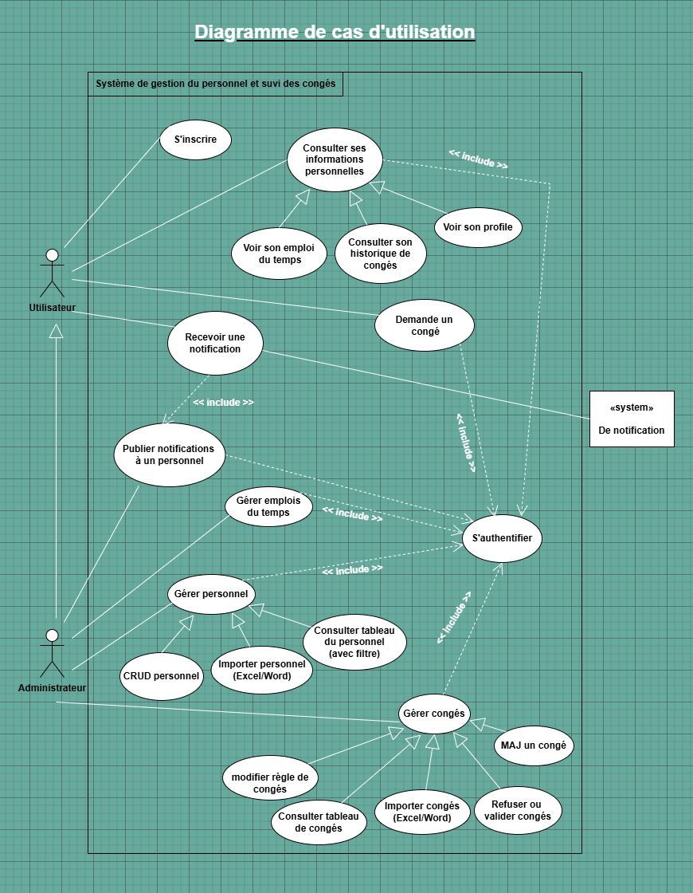
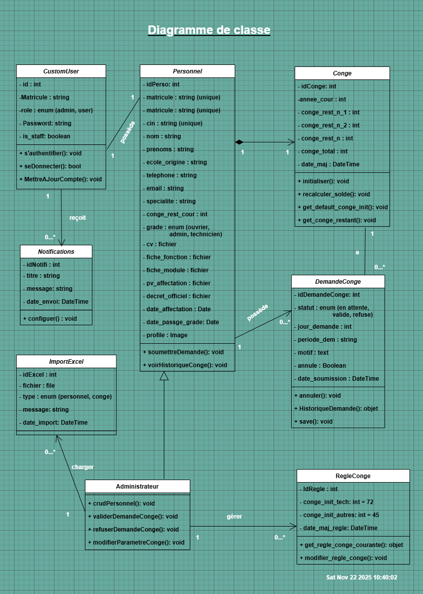
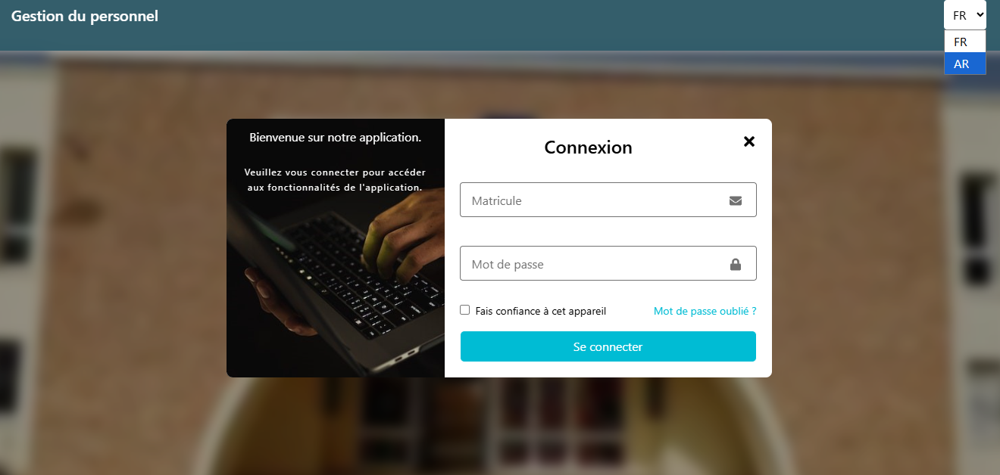
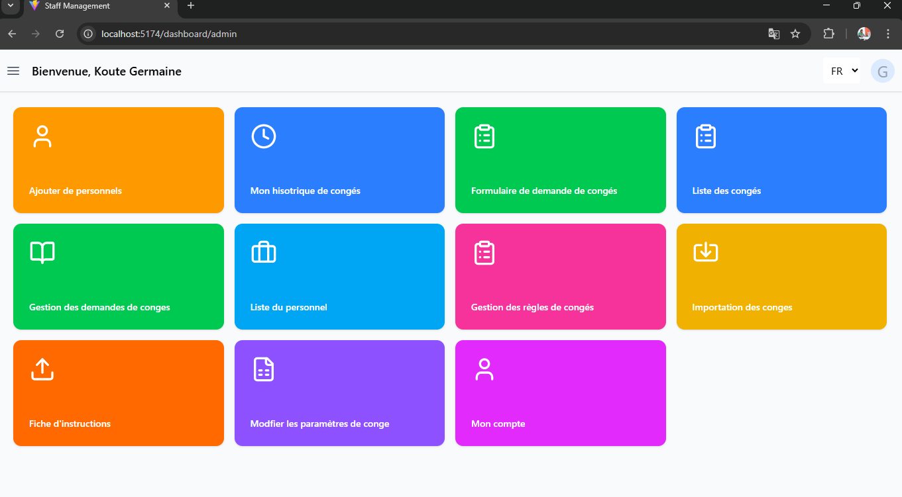
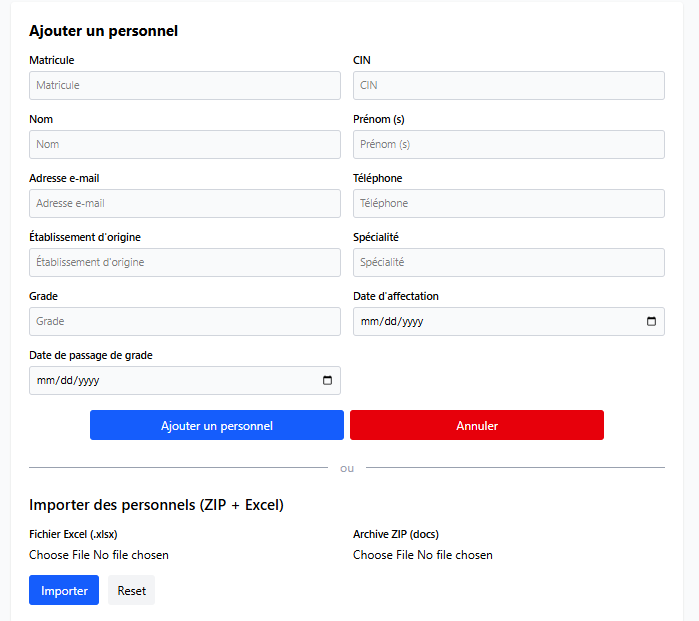
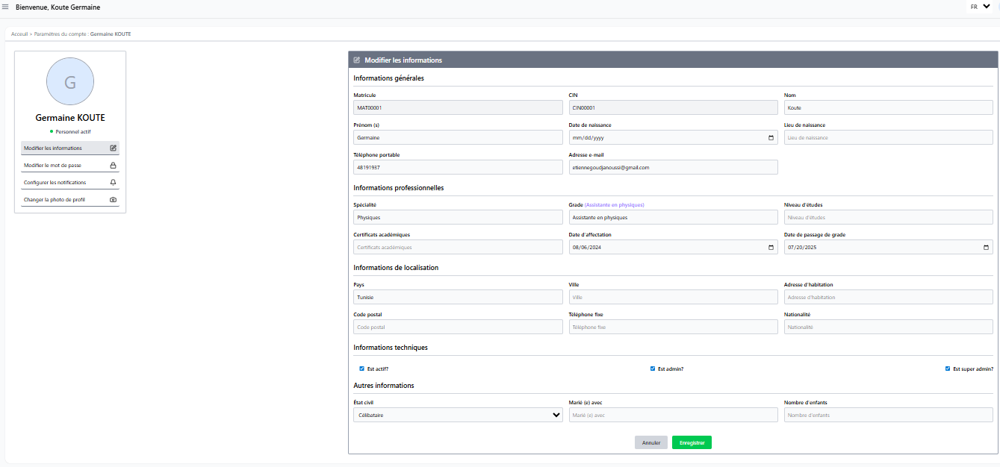
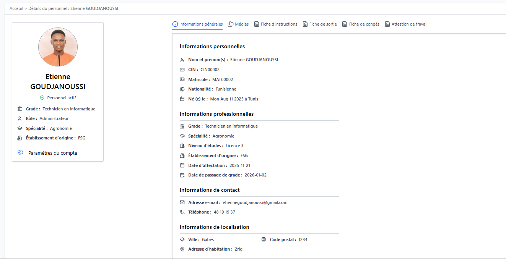

# Système de Gestion du Personnel et Suivi des Congés

> développée dans le cadre d'un projet de stage académique (Développement web React + Django).

## Aperçu du projet

Ce projet est une application Web complète permettant de gérer les personnels (administratif, technicien, ouvrier) ainsi que la gestion des congés suivant des calculs automatiques dans un établissement universitaire.

## Fonctionnalités principales

### 1. Gestion du personnel

    • CRUD complet (ajout, modifiction, suppresion, consultation).

    • Importation des personnels depuis un fichier Excel.

    • Attribution automatique des règles de congés.

### 2. Gestion des congés

    • Soumission des demandes de congés par les personnels.

    • Validation / refus par l'administrateur.

    • Calcul automatique des jours acquis, cumulés (max 2 ans).

    • Blocage automatique d'une demande après décision (verrouillage 15 minutes).

    • Historique détaillé des congés.

### 3. Athentification & Sécurité

    • Login sécurisé via JWT (Json Web Token).

    • Mise à jours du profile.

    • Réinitialisation du mot de passe via code OTP.

    • Permissions Admin / Utilisateur.

    • API sécurisée (DJR + SimpleJWT).

### 4. Interface Web moderne

    • Stack : React + TailwindCSS.

    • Dashboard Admin & Dashboard Utilisateur.

    • Plateforme multilingue : Français / Arabe (via i18next).

    • Interface entièrement responsive.

## Diagramme UML

### Conception UML : Draw.io

### Diagramme de cas d'utilisation

### Diagramme de classe

## Architecture générale du projet

### Backend : Django + Django Rest Framework

    staf_manag/
    ├── accounts/   # Authentification, JWT, profils notifications
    ├── personnel/  # CRUD personnel, import Excel
    ├── conges/     # Gestion congés, règles, demandes
    ├── meias/      # uploads (photos profils, Excel,...)
    ├── staf_manag/ # settings, urls, config principale
    └── requierements.text

#### Frontend : React.js

    staf_manag-react/
    └── src/
    ├── components/
    ├── layouts/
    ├── pages/
    ├── services/
    ├── api/
    ├── contexts/
    ├── utils/
    ├── i18n/
    ├── App.tsx
    └── main.tsx

## Technologies utilsées & installations

### Backend

    • Python 3.12

    • Django 5.2

    • DRF

    • SimpleJWT

    • PostgreSQL

    • Pandas

### Frontend

    • React + Vite

    • TailwindCSS

    • React Router

    • React Icons

    • I18next (FR/AR)

### Installation & Exécution

#### Backend : Django + PostgreSQL

    python -m venv env # création d'un environnement virtuel

    django-admin-startproject staf-manag # création du projet Django

    python manage.py startapp app_name # création d'une application nommée app_name

    # Installer Django REST Framework et JWT
    pip install djangorestframework djangorestframework-simplejwt psycopg2

    pip install -r requirements.txt # installer les dépendances

    python manage.py migrate # aplliquer les migrations

    python manage.py runerveur

#### Frontend : React + TailwindCSS

    npm install // installer les dépendances

    // création de l'application React
    npm create vite@latest staff-manag-react -- --template react

    npm install tailwindcss @tailwindcss/vite // Installation du Tailwind CSS pour le css

    npm run dev // lancer l'application

## API Endpoints principaux

### Authentification

    Méthode          Endpoint                Description

    POST          /api/auth/login/          Connexion JWT

    POST          /api/auth/login/refresh/          Refresh token

    PATCH          /api/auth/change-password/          Modifier mot de passe

    POST          /api/auth/request-reset-code/          OTP code de vérification 2F

    POST          /api/auth/reset-pasword/          Réinitialiser mot de passe

### Personnel

    Méthode                     Endpoint                    Description

    GET/POST                /api/personnels/                Afficher/créer personnels

    PUT/PATCH/DELETE        /api/personnels/<slug>/          Manipuler personnels

    POST                    /api/personnels/import/                Importer personnels

### Congés

    Endpoint                                Description

    /api/conges/                            CRUD congés

    /api/conges/demande-conge/              Demandes des congés

    /api/conges/regle-conge/                Règles d'attribution des congés

## Interfaces utilisateur

### Page de connexion

### Dashboard admin

### Page d'ajout de personnel

### Paramètres de comptes

### Pages de renseignement

### Page de l'historique des congés

### Règle des congés

## Développeur

_Gnimanvo Etienne GOUDJANOUSSI_

_Étudiant en LGLSI3 - Université de Gabès_

_email_: [etienne22.dev@gmail.com](mailto:etienne22.dev@gmail.com)

_téléphone_ : +216 48 191 937

_Github_ : [Github repositories](https://github.com/GoGnEt1?tab=repositories)

« Le meilleur moyen d'apprendre à coder, c'est de construire.»
